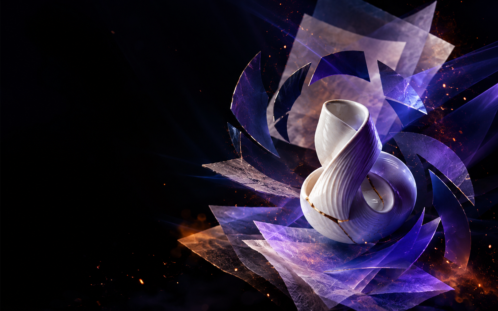
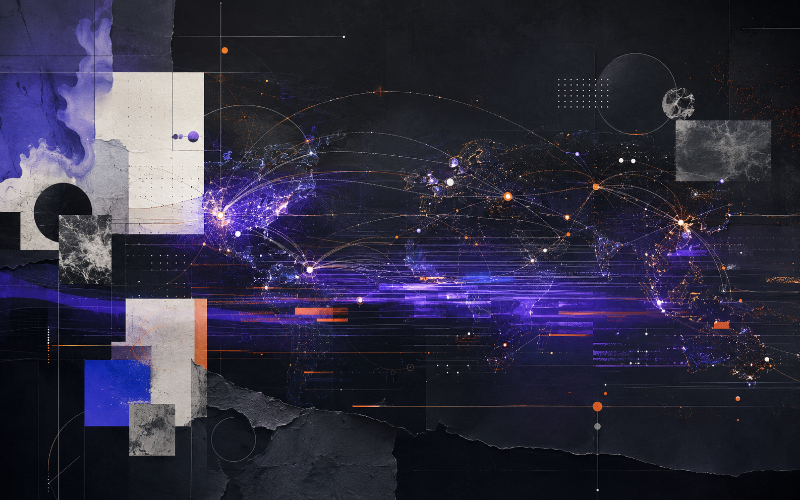
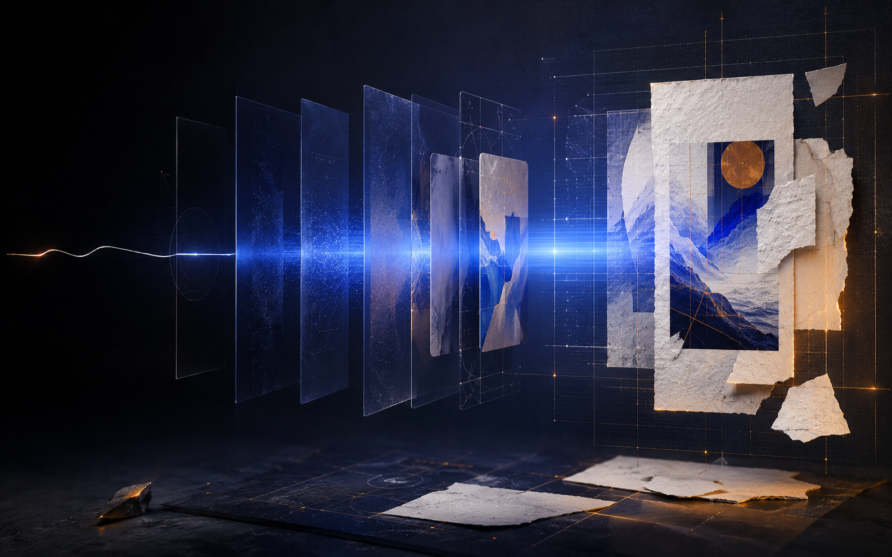
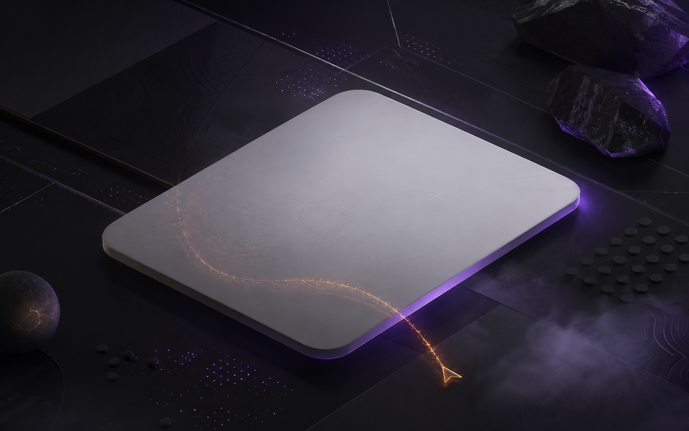
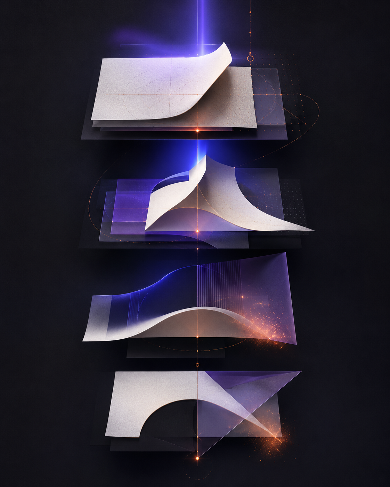

# Artystic

Artystic is a design-polish skill and editorial-style website for making interfaces feel authored instead of templated.

It ships as:

- a Next.js site showcasing the visual system
- a tiny CLI entrypoint
- a bundled Pi skill at `skills/artystic/SKILL.md`

## Showcase

### Hero / overall visual direction



### How it thinks: field, structure, and source gravity



### Design gates / critique workflow



### Prompt direction and output quality



### Command surface / how to use it



## What it is

Artystic is for pages that already work but still feel generic.

It pushes toward:

- stronger visual subject matter
- fewer, sharper containers
- mixed typography with clear roles
- meaningful image plates instead of filler chrome
- restrained motion that guides attention

## How to use it

### 1. Run the site locally

Install dependencies:

```bash
bun install
```

Start the site locally:

```bash
bun run dev
```

Run checks:

```bash
bun run check
```

### 2. Use the CLI

```bash
npx artystic
npx artystic brief
npx artystic skill
```

Commands:

- `npx artystic` — show help
- `npx artystic brief` — print the Artystic critique brief
- `npx artystic skill` — print the bundled skill path

### 3. Use the bundled Pi skill

Skill file:

```text
skills/artystic/SKILL.md
```

Use it when a page feels too safe, too same-font, too SaaS-like, too card-heavy, or visually under-authored.

## Tech stack

- Next.js 16
- React 19
- TypeScript
- Tailwind CSS 4
- Bun for local package management

## Project structure

```text
app/                  Next.js app router pages and global styles
components/           Shared UI components
bin/artystic.mjs      CLI entrypoint
skills/artystic/      Bundled Pi skill
public/assets/        Image plates and visual assets
```

## Design posture

- editorial issue-like structure
- dark ultraviolet / cobalt / ember / porcelain palette
- minimal copy
- meaningful image plates
- mixed font roles
- text-first hover treatment for buttons

## Repository

GitHub: https://github.com/Bram-cat/artyistic

## License

MIT — see [LICENSE](./LICENSE).
